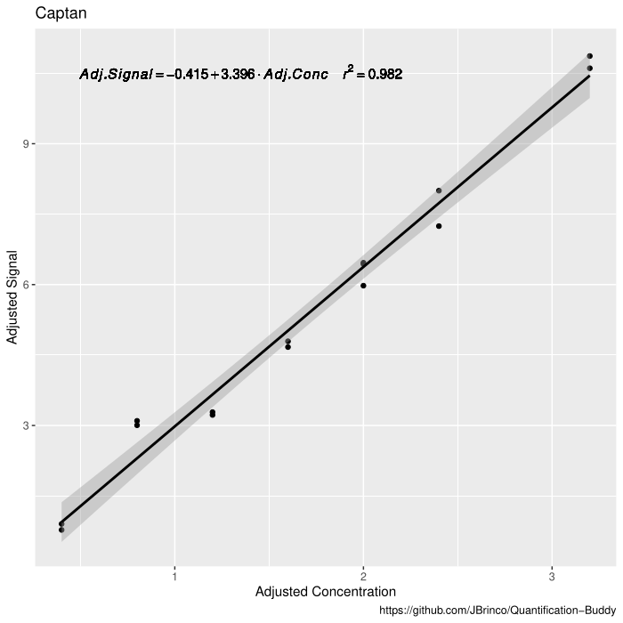

# Quantification-Buddy

__This is under development!__
Quantification using traditional calibration and internal standards in the command line.

## What am I

A simple R script that performs a calibration with external standardization (solutions of known concentration Vs obtained signal). It can also perform calculations with internal standards (for chromatography).

## How to use me

1. Download and install R. The script is written to be used from the command line with Rscript, but I will adapt it for Rstudio in the future.
2. Run the setup.r script. This will install the packages and dependencies you need. Navigate to the directory Quantification-Buddy, and type `Rscript setup.r`. If `Rscript` is not found, that probably means it is not in your PATH.
3. Open the script `qbuddy.r` in a text editor (vim, notepad, nano, etc), and edit the variables in the top of the file according to your need.
4. Now you can use me! To get instructions, just type `Rscript qbuddy.r` and I will tell you which files I need and in which order. These are described bellow. Correctly formated sample files can be found in `Sample_Files`.

## Files Needed

An example is provided for each file in this repository. Please note that the columns must have the exact same name (case sensitive).

- `Sample_signal.csv` This is the file that will have the sample names and the signals for each sample. You can have as many columns as you want, but the program will look for the one with EXACTLY the same name as the `Calibration_signal.csv` file (below). if you are using internal standard, It will also look for two columns named ConcIS and SignalIS, which are the concentration and signal of your internal standard, respectively.
- `Calculated_results.` The output file where the data actually goes. This should just have the sample names in the exact same order as the `Sample_signal.csv` file.
- `Calibration_output.` Where the calibration parameters go. Check the example file given.
- `Calibration_signal.csv` This is where your calibration data for a single compound are. The name of this file is __extremely__ important. It will determine the name of all outputs, and should be exactly the same as the corresponding column in `Sample_signal.csv` for that compound. The example given here is for a compound named Captan. The program will look for a column named Captan in `Sample_signal.csv`, and will write the output in `calculated_results` to a new column named Captan. All of this is case sensitive.

## Graphical Output

The program will output, in addition to all the juicy data you need, a graphical representation of your calibration curve. Its format can be changed in the code, obviously.

## Development

- [x] Basic functionality with one csv input of calibration and another of sample signal values. Outputs results to CSV.
- [x] Outputs good looking calibration curves with formulas to pdf.
- [x] Can process multiple calibrations at once, and one single sample signal file with values for all calibrations.
- [x] Can read columns and decide if internal standard was used or not. (two different scripts).
- [x] Options parsing, single script works with and withought IS. (Uses boolean variables at the top of the script. optparse and argparse were not working properly. If you want to help, please do.
- [ ] Writes the first column automatically in the Calibration Results (Slope, Intercept, etc.)
- [ ] Finds rows in which samples have the same name and calculates the median and standard deviation.
- [ ] Add support for Recovery calculation and adjustment of sample concentration based on recovery percentage and optional dilution factor.
- [ ] Nice looking .ods and .xlsx file for collecting the data and formatting correctly.
- [ ] Calculates Cook's distance, outputs strange data points for the user to check, and offers option to automatically remove outliers, both in calibration and samples.
- [ ] Better and prettier publication grade scatter plots.
- [ ] Adapted to be used interactively with RStudio.

## License

This project is licensed under GPL v3. You are free to use, modify, distribute, _etc._ just as long as you don't incorporate it into proprietary code, basically . Check the license for details.
